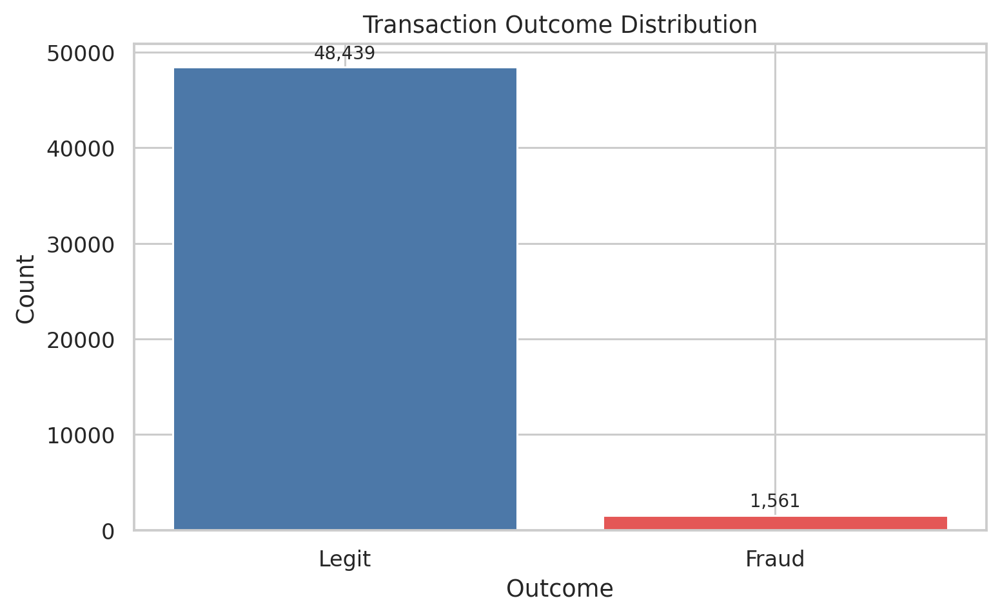
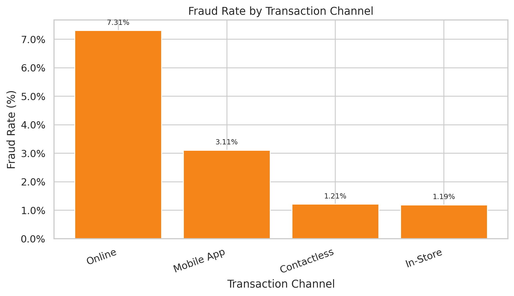
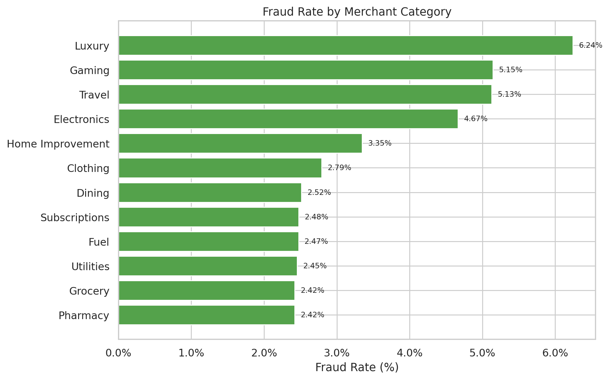
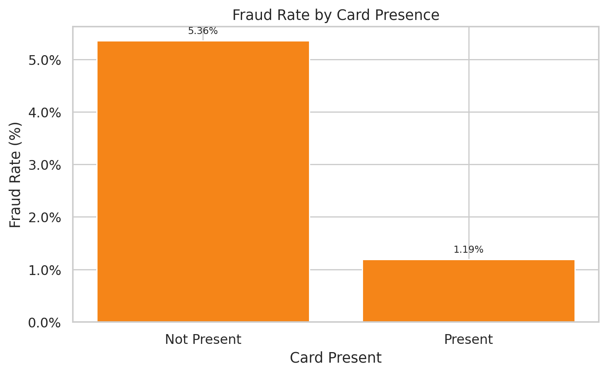
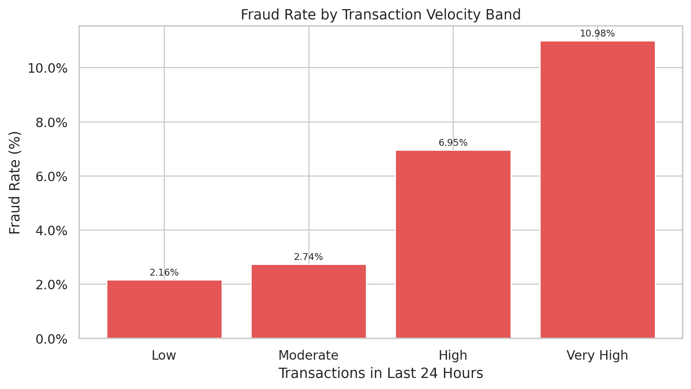
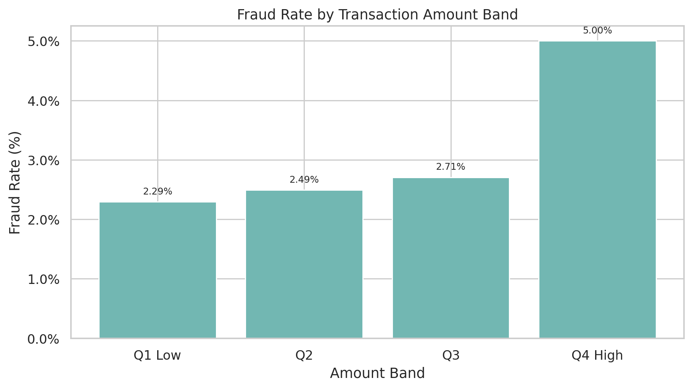
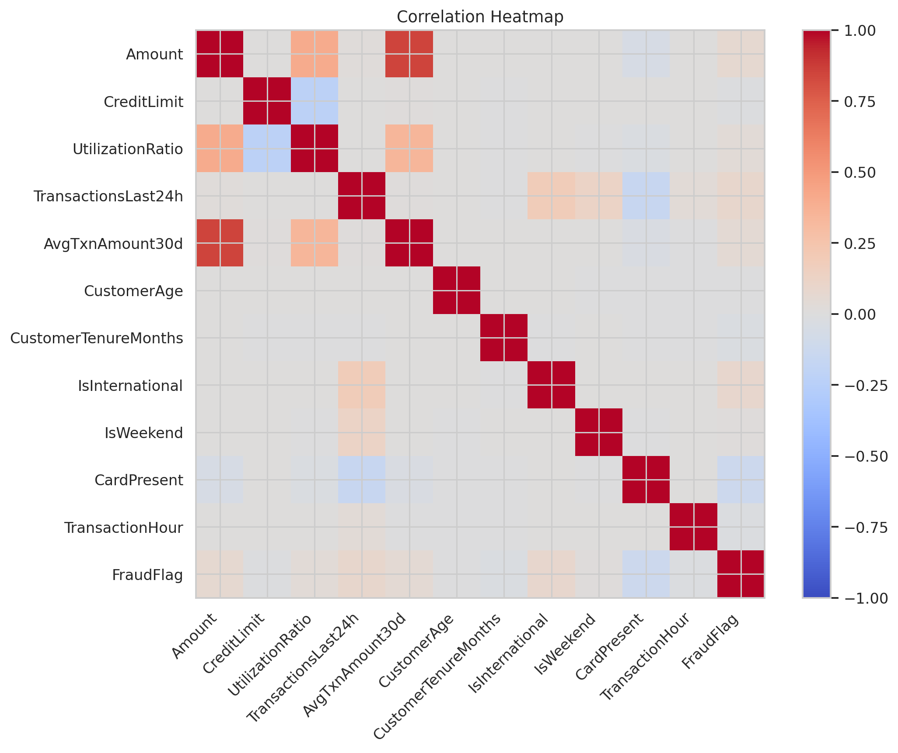
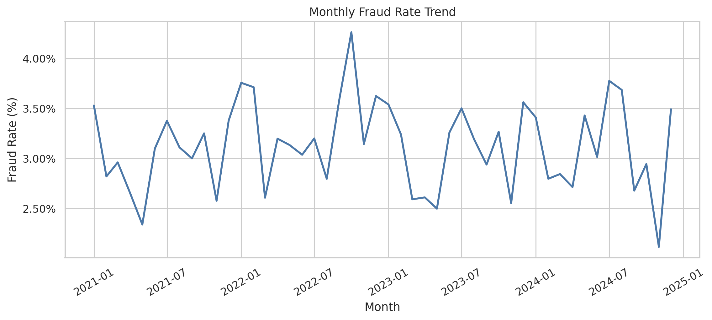
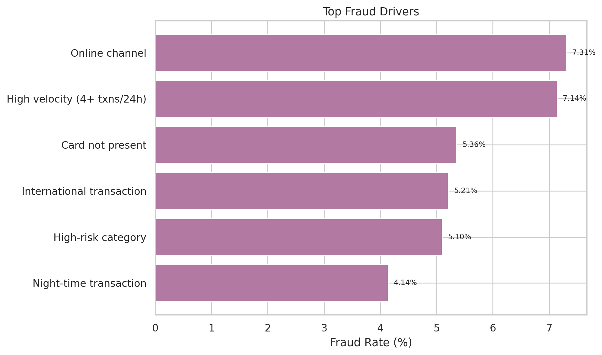

<div align="center">

# 💳 Credit Card Fraud Analysis

### Exploratory analysis of card-not-present fraud, transaction velocity, and fraud concentration using Python


</div>

---

# 📖 Project Overview

This project presents a complete exploratory analysis of a realistic synthetic credit card transaction dataset.

The goal was to study fraud patterns across transaction channels, merchant categories, countries, and transaction velocity, then identify the main fraud concentration problem and provide practical recommendations for fraud prevention.

---

# 🎯 Business Problem

**Why is fraud concentrated in a relatively small number of card-not-present, online, international, high-velocity transactions, and which transaction features should be prioritized to reduce fraud losses?**

---

# 📈 Project Statistics

📄 Raw Records: **50,500**

🧹 Cleaned Records: **50,000**

🗑 Duplicate Rows Removed: **500**

⚠️ Missing Cells in Raw Data: **7,284**

🚨 Overall Fraud Rate: **3.12%**

🌐 Online Fraud Rate: **7.31%**

💳 Card-Not-Present Fraud Rate: **5.36%**

⚡ High-Risk Share of Transactions: **19.06%**

🚨 High-Risk Share of Fraud: **52.72%**

💰 Average Amount: **$38.06**

💳 Average Credit Limit: **$9,193.69**

📅 Years Covered: **2021–2024**

🌍 Countries: **10**

📲 Channels: **4**

🏷 Merchant Categories: **12**

---

# 🔄 Analysis Workflow

1. Data Collection
2. Data Understanding
3. Data Cleaning
4. Exploratory Data Analysis (EDA)
5. Problem Identification
6. Root Cause Analysis
7. Recommendations
8. Report Generation

---

# 📂 Dataset

This project uses a realistic synthetic credit card transaction dataset designed to simulate fraud detection functions in a financial organization.

### Key Variables

- TransactionID
- TransactionDate
- TransactionHour
- CardType
- MerchantCategory
- TransactionChannel
- Country
- DeviceType
- Amount
- CreditLimit
- UtilizationRatio
- TransactionsLast24h
- AvgTxnAmount30d
- CustomerAge
- CustomerTenureMonths
- IsInternational
- IsWeekend
- CardPresent
- FraudFlag

The CSV is included in the **data/** folder so the analysis is fully reproducible.

---

# 🛠 Technologies Used

- Python
- Pandas
- NumPy
- Matplotlib
- Jupyter Notebook
- HTML
- Microsoft Word
- Git
- GitHub

---

# 📁 Project Structure

```text
credit-card-fraud-analysis
│
├── data
├── images
├── notebooks
├── reports
├── README.md
├── requirements.txt
└── .gitignore
```

---

# 📓 Analysis Notebook

➡️ **[Open the Jupyter Notebook](notebooks/Credit_Card_Fraud_Analysis.ipynb)**

---

# 📊 Visualizations

## Transaction Outcome Distribution



## Fraud Rate by Transaction Channel



## Fraud Rate by Merchant Category



## Fraud Rate by Card Presence



## Fraud Rate by Velocity Band



## Fraud Rate by Amount Band



## Correlation Heatmap



## Monthly Fraud Trend



## Top Fraud Drivers



---

# 🔍 Key Findings

- Overall fraud rate is **3.12%**.
- Online transactions have a fraud rate of **7.31%**.
- Card-not-present transactions have a fraud rate of **5.36%**.
- High-risk transactions make up **19.06%** of all transactions but account for **52.72%** of fraud.
- Fraud increases sharply with transaction velocity.
- Fraud is highest in merchant categories such as electronics, travel, gaming, and luxury.

---

# 🚨 Problem Identified

Fraud is concentrated in online, card-not-present, international, and high-velocity transactions. This means the business is exposed to a concentrated risk segment that needs stronger real-time monitoring and step-up controls.

---

# 🔎 Root Cause Analysis

- Online and mobile channels are more exposed to fraud than in-store transactions.
- Card-not-present transactions have substantially higher fraud rates.
- International transactions increase fraud risk.
- Multiple transactions in a short window are a strong warning sign.
- High-risk merchant categories such as travel, gaming, electronics, and luxury contribute disproportionately to fraud.

---

# 💡 Recommendations

- Tighten controls for card-not-present and international transactions.
- Add step-up authentication for high-risk online and mobile purchases.
- Monitor velocity spikes and repeated attempts in short time windows.
- Apply stricter rules for high-risk merchant categories.
- Increase alerts for night-time and foreign card activity.

---

# ✅ Conclusion

This project shows that credit card fraud is not evenly distributed across the portfolio. The most effective response is a targeted fraud strategy focused on transaction context, channel risk, merchant category, and transaction velocity.

---

# 📄 Reports

- 📓 Jupyter Notebook
- 🌐 HTML Report
- 📄 Microsoft Word Report
- 📈 Charts and visualizations

---

# 👨‍💻 Author

**Princetova Toby-Diala**

If you found this project useful, feel free to ⭐ the repository.
